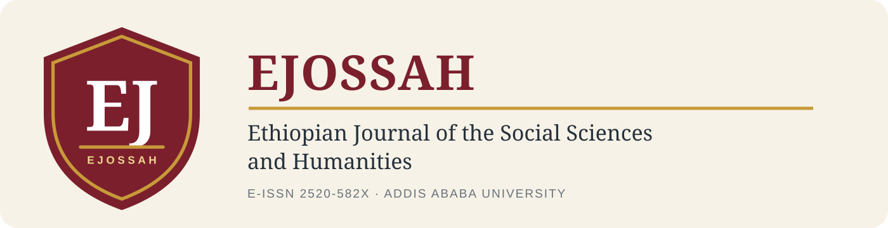
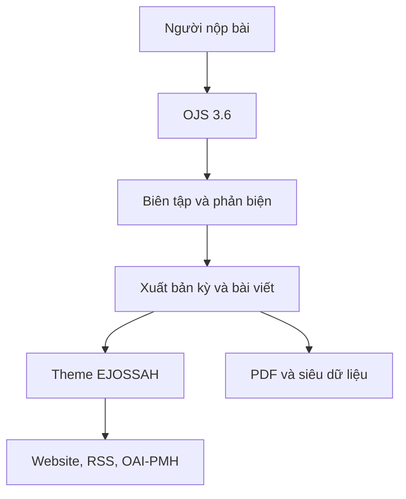

# EJOSSAH trên Open Journal Systems



[](https://pkp.sfu.ca/software/ojs/)
[](https://www.php.net/)
[](LICENSE)
[](https://doaj.org/toc/2520-582X)

Mã nguồn này xây dựng **Ethiopian Journal of the Social Sciences and Humanities (EJOSSAH)** trên nền **Open Journal Systems 3.6**. Lõi OJS tiếp tục đảm nhiệm toàn bộ vòng đời xuất bản học thuật; theme `ejossah` bổ sung nhận diện, trang chủ và trải nghiệm đọc dành riêng cho tạp chí.

> Đây là bản triển khai kỹ thuật dựa trên thông tin công khai của EJOSSAH. Trước khi vận hành như một trang chính thức, đơn vị triển khai cần xác nhận quyền sử dụng tên, nhận diện và nội dung tạp chí với chủ sở hữu tương ứng.

## Điểm nổi bật

- Quy trình đầy đủ: nộp bài, phân công biên tập, phản biện, biên tập bản thảo, dàn trang và xuất bản.
- Trang chủ học thuật, responsive, ưu tiên khả năng đọc và khả năng truy cập.
- Kỳ hiện tại và danh sách bài viết được lấy động từ OJS, không sao chép cứng vào giao diện.
- Thẻ thông tin EJOSSAH: xuất bản từ 2003, College of Social Sciences — Addis Ababa University, E-ISSN 2520-582X, hai số/năm và APC miễn phí.
- Liên kết DOAJ, nút nộp bài, kho lưu trữ, tìm kiếm và PDF được làm nổi bật.
- Không phụ thuộc font, JavaScript hay CDN bên ngoài; phù hợp môi trường mạng hạn chế.
- Giao diện quản trị theme có thể đổi màu nhấn và bật/tắt phần giới thiệu đầu trang.
- Chuỗi giao diện riêng của theme có bản tiếng Anh và tiếng Việt.

## Kiến trúc



Theme không sửa lõi OJS. Nhờ đó, có thể nâng cấp nền tảng và vô hiệu hóa giao diện tùy biến mà không làm mất dữ liệu tạp chí.

## Cấu trúc phần tùy biến

```text
plugins/themes/ejossah/
├── EjossahThemePlugin.php       # Đăng ký parent theme, tùy chọn và tài nguyên
├── assets/                      # Logo vector dùng cho OJS/README
├── locale/{en,vi}/locale.po     # Chuỗi giao diện
├── styles/index.css             # Design system và responsive
├── templates/frontend/pages/    # Trang chủ EJOSSAH động
├── index.php
├── settings.xml
└── version.xml
```

## Yêu cầu

- PHP 8.2 trở lên cùng các extension do OJS yêu cầu.
- MySQL 5.7.22+, MariaDB 10.3+ hoặc PostgreSQL 9.5+.
- Composer 2, Node.js/npm và Git khi cài từ mã nguồn.
- Máy chủ web Apache hoặc Nginx; HTTPS bắt buộc cho production.

## Cài đặt phát triển

Kho này là mã nguồn phát triển của OJS và có submodule. Clone bằng:

```bash
git clone --recurse-submodules https://github.com/Base27-CVNSS/ojs.git
cd ojs
composer --working-dir=lib/pkp install
npm install
npm run build
```

Sao chép `config.TEMPLATE.inc.php` thành `config.inc.php`, cấu hình cơ sở dữ liệu và thư mục `files_dir`, sau đó mở website để chạy trình cài đặt OJS.

Trong trang quản trị tạp chí:

1. Vào **Settings → Website → Appearance**.
2. Chọn **EJOSSAH Academic Theme**.
3. Lưu và xóa cache OJS nếu giao diện cũ vẫn còn.
4. Tải logo trong `plugins/themes/ejossah/assets/` lên phần nhận diện nếu muốn dùng wordmark chính thức của bản triển khai.

Hướng dẫn nhập cấu hình, menu, kỳ hiện tại và năm bài viết mẫu nằm tại [docs/EJOSSAH_SETUP.md](docs/EJOSSAH_SETUP.md).

## Dữ liệu và tệp tải lên

Không đặt PDF bài báo hoặc dữ liệu nhạy cảm trong thư mục public hay Git. OJS lưu tệp nộp bài trong `files_dir` ở ngoài web root. Cần sao lưu đồng bộ:

- cơ sở dữ liệu;
- `files_dir`;
- `public/`;
- `config.inc.php` bằng cơ chế quản lý bí mật, không commit mật khẩu.

## Kiểm tra nhanh

```bash
php -l plugins/themes/ejossah/EjossahThemePlugin.php
php -l plugins/themes/ejossah/index.php
```

Sau khi kích hoạt theme, kiểm tra trang chủ, kỳ hiện tại, bài viết, tìm kiếm, đăng nhập, nộp bài và bố cục ở các mốc 360 px, 768 px, 1024 px và 1440 px.

## Nguồn gốc và giấy phép

Open Journal Systems do [Public Knowledge Project](https://pkp.sfu.ca/) phát triển. Kho phái sinh này giữ giấy phép **GNU GPL v3 hoặc mới hơn** của OJS; không thể đổi toàn bộ dự án sang MIT. Xem [LICENSE](LICENSE) và `docs/COPYING` để biết đầy đủ điều khoản.

Thông tin kỳ và bài viết trong tài liệu cấu hình được tổng hợp từ trang EJOSSAH trên Ethiopian Journals Online. Bản quyền từng bài báo vẫn thuộc về tác giả/nhà xuất bản theo điều khoản công bố tương ứng.
